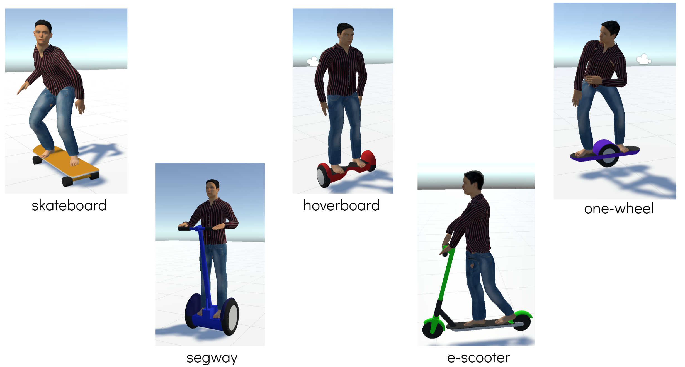
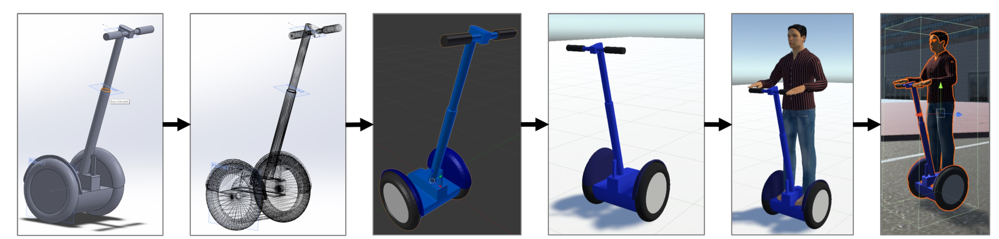
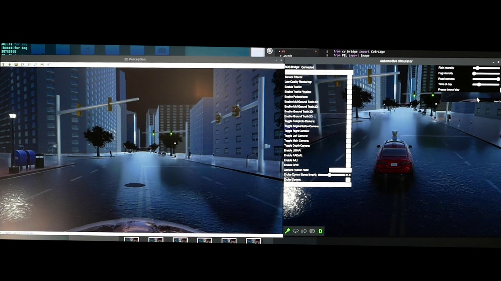
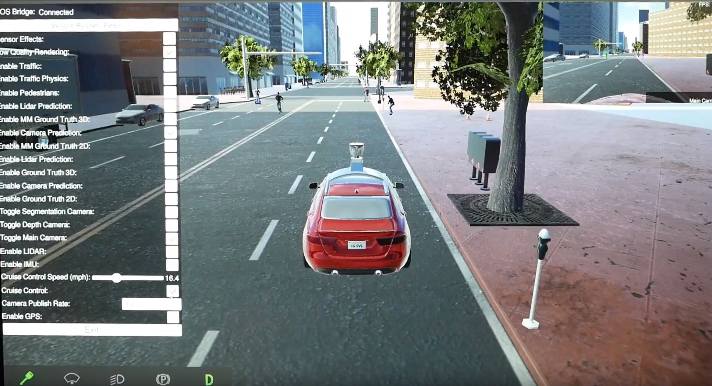
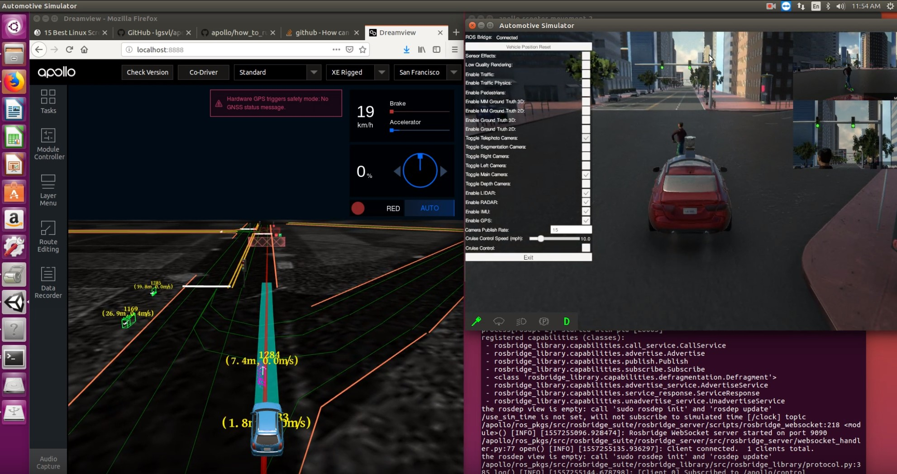

# LGSVL Automotive Simulator - Micromobility version
Modified version of LGSVL Automotive Simulator with added models of micromobility vehicles such as electric scooters, skateboards, hoverboards, segways and one-wheels. 

This project was originally forked from [lgsvl/simulator](https://github.com/lgsvl/simulator) and is based on their April 2019 release.

## [Download](https://www.dropbox.com/sh/eyyehodzsu09v31/AACRm2BwvPeow7dk2mn93Zxia?dl=0)
### To open simulator in Unity Editor
Due to size limitations of Git LFS, entire Unity project could not be hosted on GitHub. **It is instead uploaded to Dropbox and can be downloaded [here](https://www.dropbox.com/sh/eyyehodzsu09v31/AACRm2BwvPeow7dk2mn93Zxia?dl=0).**

### Release binaries
Releases are only available for Linux. You can build your own windows or linux binaries using the instructions below. 
#### Linux
1. **With Autoware Ego-car and many micromobility vehicles**: Supports rendering of object detections directly from Autoware. [Download](https://www.dropbox.com/sh/dku35yl7mhflmad/AAC7_f9wZRx-ELVIMD7I0s0La?dl=0)
2. **With Apollo Ego-car and manually controlled e-scooter**: Only contains a single scooter that can be manually controlled using IJKL keys on the keyboard. [Download](https://www.dropbox.com/sh/gyxhgcqgmd4jmqm/AABXR6ysNd1ZiCp9RE7wtZyDa?dl=0)
3. **With Apollo Ego-car and many micromobility vehicles**: Perfect for data collection. [Download](https://www.dropbox.com/sh/zfe5hda944anzuz/AACDk17giYY0DVtrx-zzjiOca?dl=0)

#### To build your own binaries
Please note that the first build can take upwards of 45 minutes to build. Subsequent builds will be much faster. Please close the Unity Editor while building as build cannot be completed with the editor open. You can build for Linux from Windows if you installed Linux build target while installing Unity.
##### Windows
```
C:\path\to\Unity\Editor\Unity.exe -batchmode -nographics -silent-crashes -quit 
-buildDestination C:\output\folder\simulator.exe 
-buildTarget Win64 -executeMethod BuildScript.Build 
-projectPath C:\path\to\simulator\source\code 
-logFile log.txt
```
##### Linux
```
path/to/Editor/Unity -batchmode -nographics -silent-crashes -quit 
-buildTarget Linux64 -executeMethod BuildScript.Build 
-buildDestination /output/folder/simulator 
-projectPath /path/to/simulator/source/code 
-logFile log.txt
```
## Modifications to the simulator 
### Micromobility vehicles added
We added the following micromobility vehicles to the original simulator.


### Process for adding micromobility vehicles

1. Solid modeling of the vehicle in a CAD software.
2. Solid model is then saved as a mesh in .STL format.
3. Import mesh into Blender and add materials to the model. Here the Origin is translated to Center of Gravity of the model and the axis are rotated to match defaults followed by Unity. Not doing this can lead to a lot of headache in manipulating the vehicle in Unity later.
4. This model is then saved in .FBX format and imported into a Unity test scene as a `GameObject`. The model is scaled to correct dimensions, if necessary.
5. Add `RigidBody` component to the model and add a realistic mass value. Humanoid used here is downloaded from the Unity Asset Store [here](https://assetstore.unity.com/packages/3d/characters/humanoids/rcp-caucaisan-character-models-81402#). Initially, the humanoid is configured in a T-orientation. Limbs and joints need to be manipulated to appropriate positions.
6. A `BoxCollider` is added to the `GameObject` and its boundaries are scaled to fit the entire model. It is then saved as a prefab and imported into the San Francisco Scene. To make handling of these vehicles easier, we created separate
layers for each vehicle type listed above and distributed them into these layers.

Please follow these steps if you would like to add your own vehicles.

### Modifications to ego-car
LGSVL simulator provides separate ego-cars configured with sensor suites to work with Apollo and Autoware self-driving stacks respectively. At this stage, the sensors on these ego-cars cannot "see" the new vehicles we added. More modifications need to be made in order for these vehicles to be perceived by ego-cars as NPCs (Non-playable characters).

1. **Adding Ground Truth Sensors for micromobility vehicles:** In order to detect ground truths for micro-mobility vehicles, we added two additional sensors to the ego-car – `MMGroundTruth2D` and `MMGroundTruth3D` – for 2D and 3D ground truth bounding boxes respectively. These sensors are similar to the existing ground truth sensors except that they only output boxes for micro-mobility vehicles’ layers. Bounding box colors are defined in this sensor and toggle switches to turn these sensors on or off are also added. These sensors publish to the following topics:
* `MMGroundTruth2D`
  * Topic: `/simulator/ground truth/mm_2d_detections`
  * Message type: `Detection2DArray`
* `MMGroundTruth3D`
  * Topic: `/simulator/ground truth/mm_3d_detections`
  * Message type: `Detection3DArray`
2. **Modifying Culling Masks:** Users can selectively choose the layers that perception sensors in the car, such as cameras, LiDAR and depth sensors, can ”see” by choosing them the `CullingMask` selector. By default, the newly added layers for micromobility vehicles are not added to the `CullingMask`. Therefore, the new vehicles need to be selected in the `CullingMask` selector for the sensors to render them.
3. **Modifications to Perception sensors:** The number of channels in the LiDAR sensor were changed from 16 (default) to 64. In addition, motion blur was removed from the `DriverCamera GameObject` as it resulted in blurry images at lower frame rates.
4. **Modifications to `NeedsBridge` list:** The `NeedsBridge` list contains references to all components that are only instantiated when a ROSBridge server is active and the simulator is connected as a client. This is done so that the simulator does not waste resources and publish messages to topics if no nodes are subscribing to them over ROSBridge. By default, `MMGroundTruth2D`, `MMGroundTruth3D` and the depth camera are not added to `NeedsBridge` list. The script components of these sensors are added to `NeedsBridge` list in order to send messages over ROSBridge.

### Manually controlling micromobility vehicles
Currently, only controlling e-scooters is supported. To enable controlling an e-scooter, select the `GameObject` and check its Script component. You will then be able to control it with IJKL keys.

## Projects with modified simulator

### 1. Detection of Micromobility vehicles from camera images
ROS packages developed for this project are available on this [repository](https://github.com/deepaktalwardt/lgsvl_micromobility_ros_pkgs).

#### Dataset collection
`lgsvl_data_collector` ROS package available [here](https://github.com/deepaktalwardt/lgsvl_micromobility_ros_pkgs) is developed to collect data from this simulator. This package collects main camera images, depth camera images, LiDAR point clouds and Micromobility 2D and 3D Ground Truth annotations. We have provided the datasets we collected below.
* [Dataset 1](https://www.dropbox.com/s/9cvsmraio6q6v0d/large_dataset_1.zip?dl=0)
* [Dataset 2](https://www.dropbox.com/s/kt6hwfsa95v4hck/large_dataset_2.zip?dl=0)

#### [YOLOv3 Repository trained on dataset collected from this simulator](https://github.com/deepaktalwardt/keras-yolo3)
This repository shows how we trained YOLOv3 Object Detection algorithm on the dataset we collected from the modified simulator. Please follow the instructions on the repository if you would like to perform your own training on your own datasets. 

Hyperparameters chosen for training are provdided in detail in the project presentation [here](https://docs.google.com/presentation/d/1NzCOh9w1M_gmNOr4F7BRGH3UlDinqTB6wfFwwc2YfJY/edit#slide=id.g573837cf9f_3_91)

#### Real-time inference
With the Simulator and model inference running on the same GPU, we were able to achieve ~18 FPS performance. We provide two methods of visualizing inference results on camera images captured in realtime from the simulator. Please use `lgsvl_mm_perception` ROS package from the above mentioned [repository](https://github.com/deepaktalwardt/lgsvl_micromobility_ros_pkgs) to run inference. 
##### Video - Displaying detections in a separate window
[](https://www.youtube.com/watch?v=DwWY89dVGEw)

##### Video - Displaying detections directly into the simulator
[](https://www.youtube.com/watch?v=72CPQL3bGWQ&t)

### 2. Testing how Baidu Apollo works with modified simulator
[](https://www.youtube.com/watch?v=TVreirGAxmI)

### 3. 3D Detection of Micromobility vehicles from LiDAR Pointclouds using YOLO3D (coming soon)

## Links
### Project report
### [Project presentation](https://docs.google.com/presentation/d/1NzCOh9w1M_gmNOr4F7BRGH3UlDinqTB6wfFwwc2YfJY/edit?usp=sharing)

## Acknowledgements
We would like to thank Martins Mozeiko and Brian Shin from LGSVL lab for supporting us and providing technical help throughout this project.

## Contributors
* **Deepak Talwar** - (https://github.com/deepaktalwardt)
* **Seung Won Lee** - (https://github.com/swdev1202)
### This repository was originally developed for CMPE 297 - Autonomous Driving course at San Jose State University in Spring 2019.
